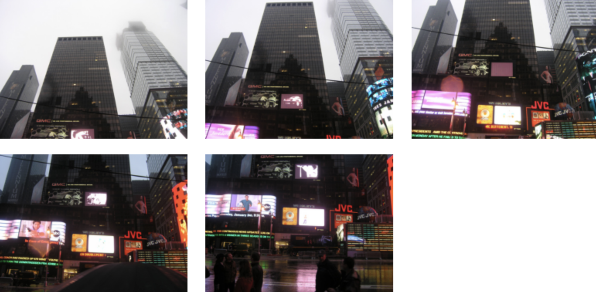
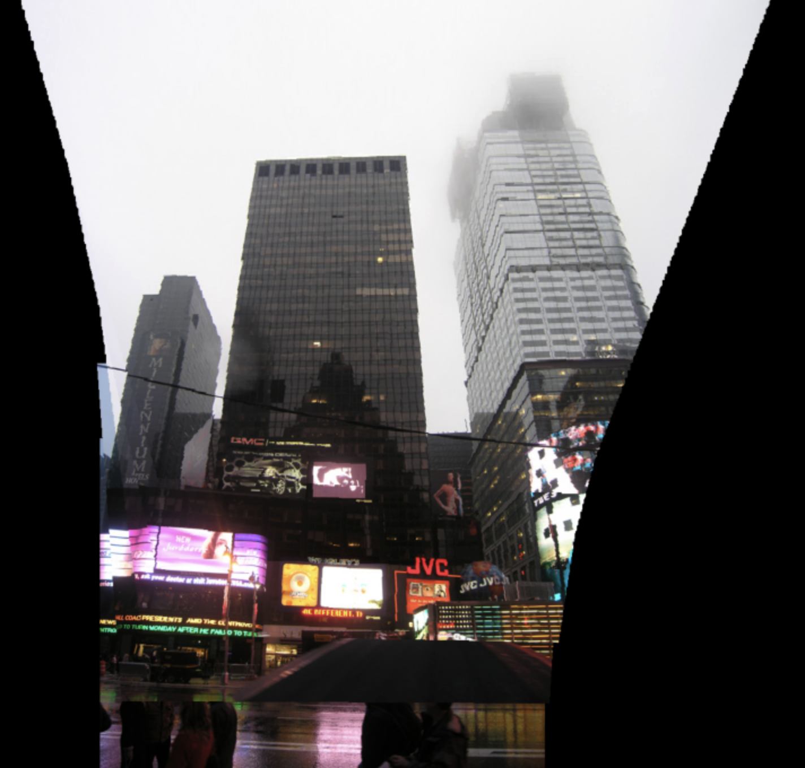
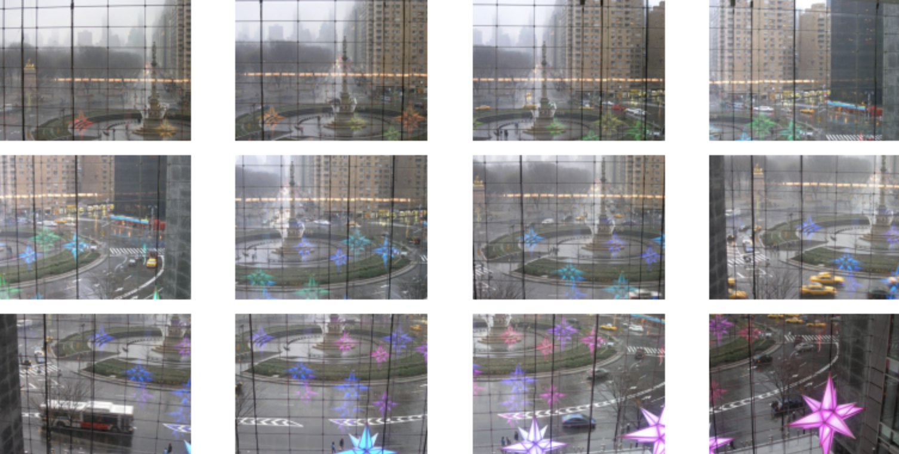
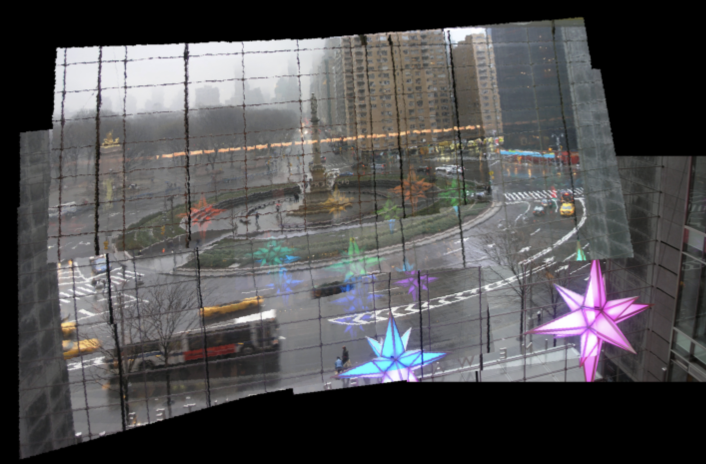
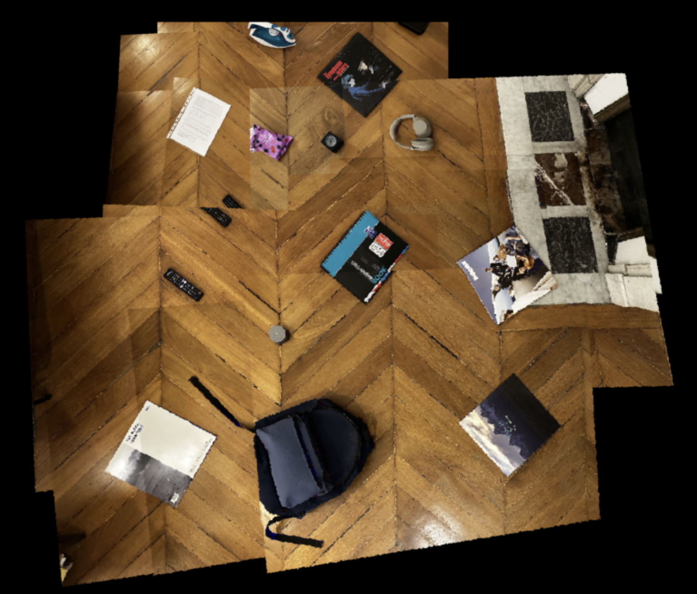

# SIFT Implementation and Image Stitching
This project is led by [@ahmedhassayoune](https://github.com/ahmedhassayoune) and [@etienne2509](https://github.com/etienne2509) at french software engineering school EPITA.
It is a C++ implementation of the SIFT algorithm, a computer vision algorithm that extracts keypoints and computes their descriptors.

> The SIFT algorithm was later used to apply image stitching from a collection of images. This work can be seen in the **`stitching/sift_stitch.ipynb`** notebook.

## How to run the project
You can run the project by running the following commands:

```bash
make all
./sift <path_to_image1> <path_to_image2>
```

## Examples of Scene Reconstruction results

<table>
  <tr>
    <th>Original Fragments</th>
    <th>Reconstructed Scene</th>
  </tr>
  <tr>
    <td>
      
    </td>
    <td>
      
    </td>
  </tr>
  <tr>
    <td>
      
    </td>
    <td>
      
    </td>
  </tr>
  <tr>
    <td>
      
    </td>
    <td>
      
    </td>
  </tr>
</table>


## Notes
Presentation: [Google Slides](https://docs.google.com/presentation/d/1nAttcCdMPEyDcku6fAwdMRwFNrLZhAyZVhNWxuq1dck/edit?usp=sharing)

## References
- Lowe, D. G. (2004). "Distinctive Image Features from Scale-Invariant Keypoints." Computer Science Department, University of British Columbia, Vancouver, B.C., Canada. [PDF](https://www.cs.ubc.ca/~lowe/papers/ijcv04.pdf)
- Islam, R. (2020). "Implementing SIFT in Python: A Complete Guide (Part 1)." Medium. [Link](https://medium.com/@russmislam/implementing-sift-in-python-a-complete-guide-part-1-306a99b50aa5)
- Singh, A. (2024). "What is SIFT (Scale Invariant Feature Transform) Algorithm?" Analytics Vidhya. [Link](https://www.analyticsvidhya.com/blog/2019/10/detailed-guide-powerful-sift-technique-image-matching-python/)
